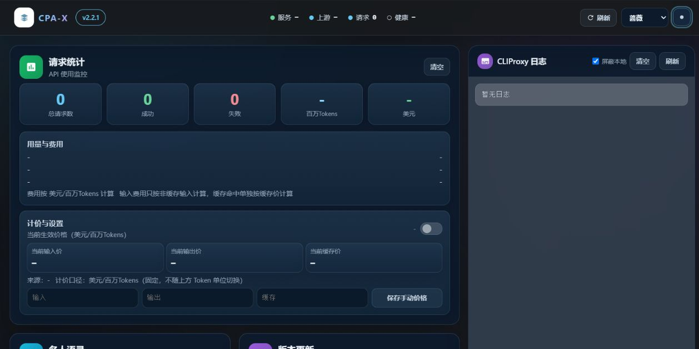
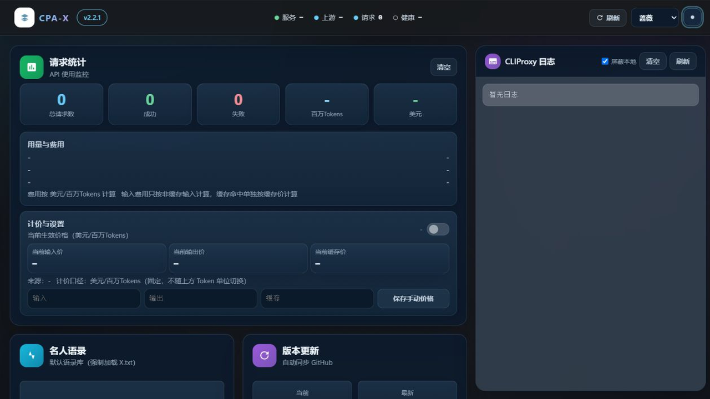
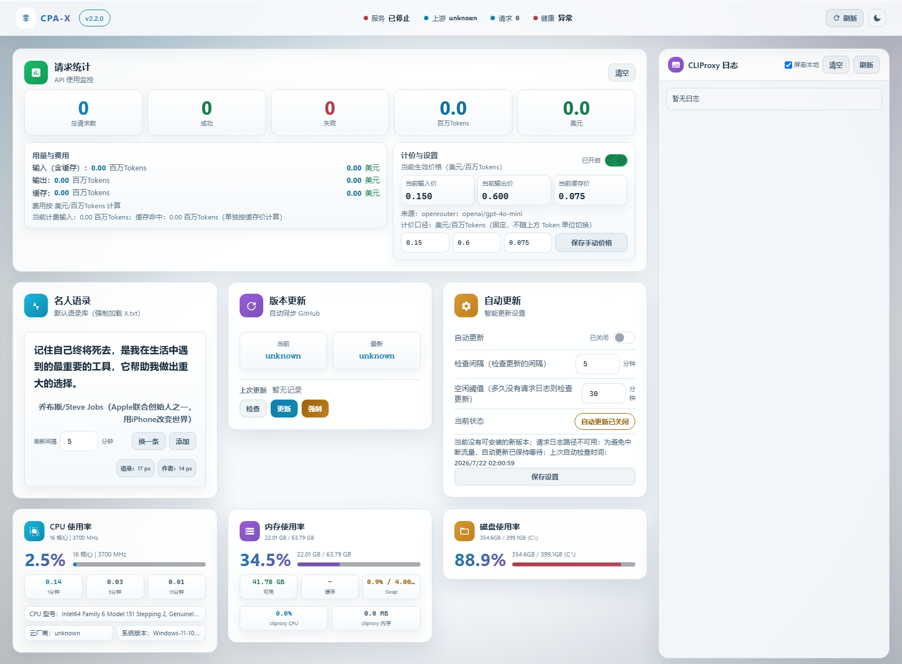
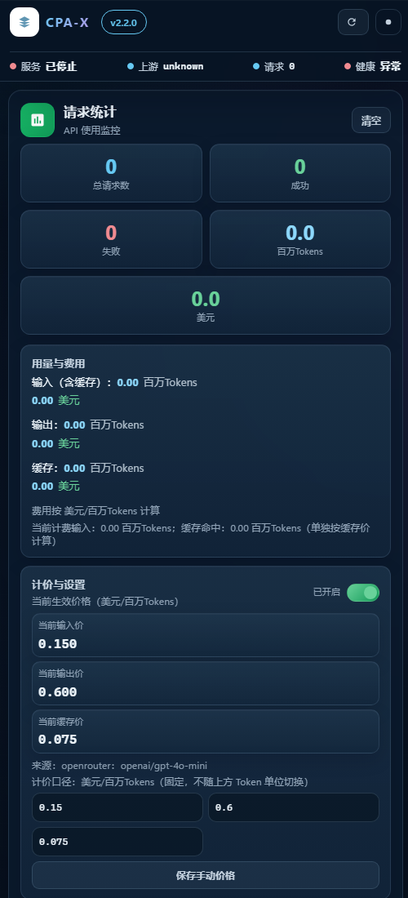

# CPA-X — CLIProxyAPI 管理面板（v2.2.1）

[English](README.md) | 中文

[](https://github.com/ferretgeek/CPA-X/actions/workflows/ci.yml)
[](https://github.com/ferretgeek/CPA-X/releases/latest)
[](LICENSE)

[](https://github.com/ferretgeek/CPA-X/releases/latest)

一个用于 **CLIProxyAPI** 的监控与管理面板，支持健康检查、资源监控、日志查看、更新管理、请求统计与定价显示等功能。

v2.2.1 针对一次间歇 `502` 生产故障强化更新流程：部署成功必须由带认证的真实管理接口返回 HTTP `200`，失败版本会持久指数退避，匿名 GitHub 检查优先使用稳定 Release 跳转，并彻底停止废弃 usage 后台轮询。

> 当前安全策略：**前端已移除所有导出入口，主配置写回默认关闭**；配置区仅保留查看/校验能力，如确需恢复写回，必须在 `.env` 中显式设置 `CLIPROXY_PANEL_CONFIG_WRITE_ENABLED=true`。

> **AI 优先**：本仓库主要面向 AI Agent 部署/运维（而不是人类手动部署）。
> - AI 部署手册：`AI_DEPLOY_CN.md`
> - Agent 指引：`AGENTS.md`
> - 更新说明：`RELEASE_NOTES_v2.2.1.md`
> - 版本历史：`CHANGELOG.md`
> - 开箱即用发行包：[下载最新版](https://github.com/ferretgeek/CPA-X/releases/latest)

## 核心能力

| 能力 | 说明 |
| --- | --- |
| 跨时区可靠性 | 自动推断无偏移日志时间，API 统一输出 UTC/RFC 3339，适配国内外服务器与容器。 |
| 安全自动更新 | 在线准备、SHA-256 校验、原子替换、真实管理接口健康确认、失败回滚与版本退避。 |
| 用量与费用 | 以请求日志提供实时请求统计，并保留已有本地兼容快照中的历史 Token 与费用数据。 |
| 长期运行 | 增量日志解析、原子持久化、后台退避与备份数量/天数/容量三重限制。 |
| 可读界面 | 无外部字体依赖的响应式 UI，提供天光、薄荷、蔷薇、暖砂四套浅色主题与 `#17191d` 深灰模式。 |
| 多种部署 | 支持 Linux/systemd、Windows 与 Docker 监控模式，并提供自动探测安装脚本。 |

## 预览图

### 深色主题


### 浅色主题


### 移动端布局


## 适用环境
- **推荐：Linux**（面板含 `systemctl` 相关功能）
- Python 3.11+
- 需要能访问 CLIProxyAPI 的管理接口（默认 `http://127.0.0.1:8317`）

> Windows 也可以运行，但"服务控制/自动更新"等 systemd 相关功能不可用。

## 一条龙安装（新手版）

### 0) 一键安装（推荐）
```bash
# Linux（会自动注册 systemd 服务；安装器会尽力自动探测并补齐 .env）
bash scripts/install.sh

# 如需手动再跑一次自动探测（推荐）
python3 scripts/doctor.py --write-env
```

```powershell
# Windows（后台启动）
powershell -ExecutionPolicy Bypass -File scripts/install.ps1
```

### 1) 克隆项目
```bash
git clone https://github.com/ferretgeek/CPA-X.git
cd CPA-X
```

### 2) 创建虚拟环境并安装依赖
```bash
python -m venv .venv
# Windows
.venv\Scripts\activate
# Linux / macOS
source .venv/bin/activate

python -m pip install --upgrade "pip>=26.1.2"
python -m pip install -r requirements.txt
```

### 3) 配置环境变量
复制示例文件并按需修改：
```bash
# Windows
copy .env.example .env
# Linux / macOS
cp .env.example .env
```

重点配置：
- `CLIPROXY_PANEL_CLIPROXY_DIR` / `CLIPROXY_PANEL_CLIPROXY_CONFIG`
- `CLIPROXY_PANEL_CLIPROXY_LOG`
- `CLIPROXY_PANEL_CLIPROXY_API_BASE` / `CLIPROXY_PANEL_CLIPROXY_API_PORT`
- `CLIPROXY_PANEL_MANAGEMENT_KEY` / `CLIPROXY_PANEL_MODELS_API_KEY`（如上游启用了密钥）
- `CLIPROXY_PANEL_CLIPROXY_SERVICE` / `CLIPROXY_PANEL_CLIPROXY_BINARY`（自动更新需要）
- `CLIPROXY_PANEL_LOG_TIMEZONE`（默认 `auto`；也支持 `UTC`、`+08:00`、`Asia/Shanghai` 等）
- `CLIPROXY_PANEL_BACKUP_*` / `CLIPROXY_PANEL_UPDATE_REQUIRE_CHECKSUM`（备份上限与更新校验策略）
- `CLIPROXY_PANEL_AUTO_UPDATE_FAILURE_BACKOFF_*` / `CLIPROXY_PANEL_SERVICE_HEALTH_TIMEOUT_SECONDS`（失败版本退避与真实管理接口健康检查）
- `CLIPROXY_PANEL_CONFIG_WRITE_ENABLED`（默认 `false`；只在你明确接受风险时才开启主配置写回）
- `CLIPROXY_PANEL_GITHUB_TOKEN`（可选：提高 GitHub 限流额度，减少 `latest=unknown`）
- `CLIPROXY_PANEL_PRICING_*`（可选：费用估算；默认支持自动同步 OpenRouter 定价，可用 `CLIPROXY_PANEL_PRICING_AUTO_ENABLED=false` 关闭）
- `CLIPROXY_PANEL_QUOTES_PATH`（可选扩展语录库；仓库根目录的 `X.txt` 始终强制加载，当前共 181 条）

### 4) 启动面板
```bash
python app.py
```

打开浏览器访问：
```
http://127.0.0.1:8080
```

## Docker/容器部署（可选）

适用场景：你只需要“监控与查看”（状态/统计/模型/日志/配置读取）。  
不适用场景：你需要“自动更新/服务控制”（容器里通常没有 systemd，默认做不了）。

仓库已提供：
- `Dockerfile`
- `docker-compose.yml`
- `.env.docker.example`

最短路径（推荐用 compose）：
```bash
cp .env.docker.example .env.docker
# 生成随机值并写入 CLIPROXY_PANEL_PANEL_ACCESS_KEY（至少 32 字符）
docker compose --env-file .env.docker up -d --build
```

Compose 默认只把端口发布到宿主机 `127.0.0.1`，并在访问密钥为空时拒绝启动。服务器远程访问请保持回环发布，通过带 TLS 的反向代理转发；不要把容器端口直接暴露到公网。

如需“日志/配置/auth 文件”等功能，请按 `docker-compose.yml` 的注释挂载宿主机文件/目录，并把相关 `CLIPROXY_PANEL_*` 环境变量改成容器内路径。注意：这里的“配置”默认仅支持读取与校验，不会写回宿主机主配置。

## 常见问题
### 1) 页面能打开但数据为空
检查 CLIProxy 是否在运行，并确认 `.env` 中的 `CLIPROXY_PANEL_CLIPROXY_API_BASE/PORT` 指向正确。

新版 CLIProxyAPI 已移除旧 usage 管理接口。CPA-X 不再后台轮询这些接口，实时请求数量改由日志增量统计；升级前已经落盘的 Token 与费用历史仍从本地兼容快照读取，不会因为上游接口 `404` 反复重试。

### 2) 健康检查超时
容器或负载均衡探活请使用无需密钥、只返回最小信息的 `/api/healthz`。完整诊断使用 `/api/health`。

### 3) systemd 相关功能不可用
这是 Linux 专用功能，Windows 环境下会自动失败但不会影响面板启动。

## 安全提示
- **不要把 `.env` 提交到仓库**（已在 `.gitignore` 中忽略）
- 管理密钥、模型密钥等敏感字段请只放在 `.env`
- 面板默认只监听 `127.0.0.1`。任何非回环监听都必须同时设置至少 32 字符的 `CLIPROXY_PANEL_PANEL_ACCESS_KEY`，否则进程拒绝启动
- 设置访问密钥后，`/api/*` 只接受 `X-Panel-Key`；浏览器 URL 参数仅用于首次写入本地存储并会立即移除，仍应避免在共享日志中使用
- 跨域访问默认关闭；只有明确需要时才设置逗号分隔的 `CLIPROXY_PANEL_CORS_ORIGINS`
- 前端已移除所有导出入口，避免把敏感内容通过浏览器下载链接暴露出去
- 主配置写回默认关闭；如你非常确定要恢复，才在 `.env` 中显式设置 `CLIPROXY_PANEL_CONFIG_WRITE_ENABLED=true`

## 开发验证

```bash
python -m pip install --upgrade "pip>=26.1.2"
python -m pip install -r requirements-dev.txt
python -m pytest
ruff check --select E9,F63,F7,F82 app.py scripts tests
```

## 社区与贡献

- [参与贡献](CONTRIBUTING.md)
- [安全策略](SECURITY.md)
- [运维：架构、升级、备份、恢复与卸载](OPERATIONS.md)
- [获取帮助](SUPPORT.md)
- [社区行为准则](CODE_OF_CONDUCT.md)
- [问题反馈](https://github.com/ferretgeek/CPA-X/issues/new/choose)
- [讨论区](https://github.com/ferretgeek/CPA-X/discussions)

## 许可协议
MIT License（见 `LICENSE`）
